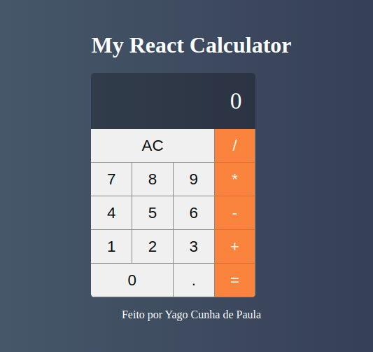

## My React Calculator

Calculadora feita em React JS com o intuito de assimilar os conceitos básicos de React como Componentização, estado e propriedades.

	

Projeto desenvolvido no curso **Curso React + Redux: Fundamentos e 2 Apps do Absoluto ZERO!** feito pela plataforma udemy.

Espero que gostem do resultado!
